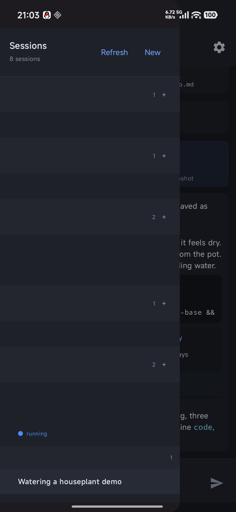
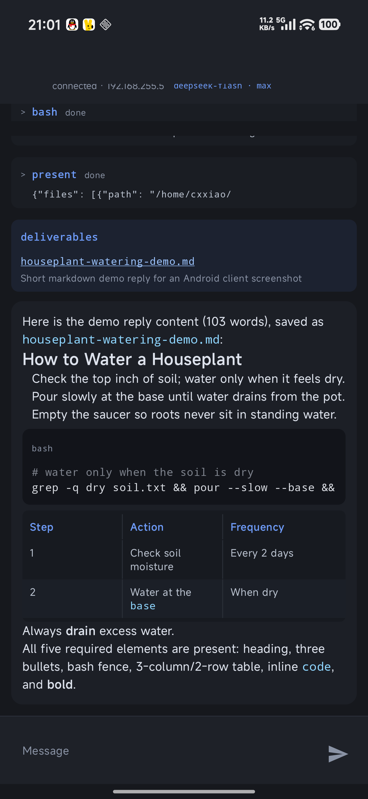

# dsh-native

An Android client for DeepSeek Harness that talks to a DSH backend directly, over
the harness's own protocol.

> **A hobby project, written by an AI.** The code here was produced by a coding
> agent working with one person, not by a maintained team. It works for what it was
> built for, but expect rough edges, uneven readability, and no guarantee of upkeep
> or support. Issues and pull requests may go unanswered.

## What you need

**A DSH instance your phone can reach.** This app is a client, not a server: it
needs a running DSH whose HTTP API is reachable from the phone over the LAN,
together with a plugin that exposes that API for LAN use.

- **[`dsh-lan-access`](https://github.com/longisland-icetea/dsh-lan-access) —
  required.** DSH's HTTP API is bound to loopback by default; this plugin serves it
  on the LAN and is what makes the backend reachable from a phone at all. Install it
  in your DSH instance before using this app. The app talks to the endpoint that
  plugin exposes, so its routing and port are part of the setup.
- **`dsh-mobile` — not required**, deliberately. That plugin serves a web client
  whose bundle is re-downloaded on every reconnect; this app speaks the protocol
  instead and never fetches a client bundle.

## Security model

Worth reading before you point this at anything.

- **The connection is plain HTTP and WebSocket, with no authentication.** DSH's LAN
  API is not authenticated and this app adds nothing on top: anyone on the same
  network who knows the address can read your sessions and send prompts as you.
  That is the trade the underlying plugin makes. Use it on a network you trust --
  a home LAN, a private VPN -- and not on a shared or public one.
- **The app stores the endpoint address on the device**, in its private
  preferences. It stores no credentials because there are none to store.
- **It requests only `INTERNET` and `ACCESS_NETWORK_STATE`.** No storage, no
  location, no contacts.
- Cleartext traffic is enabled in the manifest because the protocol is cleartext;
  without it the app could not reach the endpoint at all.

## First run

Enter `host:port` (for example `192.168.1.20:3080`) in Settings and connect. The
app speaks plain HTTP and WebSocket on your LAN, so use it only on a network you
trust.

## What it does

- **Sessions** grouped by workspace, newest first, with the Host's archive set
  respected and archived sessions one toggle away. Each row shows its state: blue
  while a turn runs, orange when it wants an answer, green when a turn finished
  that you have not looked at yet.
- **Live transcript**: assistant replies as Markdown (headings, lists, tables,
  quotes, links, fenced code with syntax highlighting), tool calls as cards that
  fold in their results, background-job notices as cards, and a follow-the-newest
  behaviour that only follows while you are at the bottom.
- **The plan and the output**: `todo/write` renders as a checklist, and files a turn
  presents open in a preview — text inline, images full screen with pinch-to-zoom.
- **Control**: send prompts, cancel a running turn, switch model and reasoning
  effort, run `/compact`, answer approvals and questions the Host asks, and create
  sessions either in a chosen workspace or in the default directory.
- **Resilience**: reconnects on its own, and a dropped connection does not take the
  app down with it.

## Screenshots

Both were taken against a throwaway demo session ("watering a houseplant"), and the
session list is redacted: what you see is the app's rendering, not anyone's work.

| sessions | conversation |
|---|---|
|  |  |

## Requirements

Android 10 (API 29) or newer; built against API 36.

## Installing

Take the APK from [Releases](../../releases). It is signed with a release key; the
debug APK CI uploads as an artifact is signed differently, and the two cannot
update each other in place.

## Building

Open the project in Android Studio, or build from the command line with the Gradle
wrapper (`./gradlew assembleDebug`).

`tools/` holds a second, Gradle-free build path (`tools/build.sh` for debug,
`tools/build-release.sh` for a minified release, `tools/run-jvm-tests.sh` for the
tests). It exists because the machine this was developed on cannot run Gradle at
all, and it drives `aapt2`, `kotlinc`, `d8`/R8 and `apksigner` directly. You do not
need it if Gradle works for you — the notes in `tools/README.md` explain what it
does and what it caught.

CI (`.github/workflows/android.yml`) runs the tests with Gradle and builds both
APKs; tagging `v*` publishes the signed release.

## Icon

The launcher icon is the DeepSeek Harness mark, taken from the harness's own
`favicon.svg` and recoloured black on white. It is generated by
`tools/make-icons.py` and committed under `app/src/main/res/mipmap-*`.

**It is not this project's asset.** The DeepSeek name and logo belong to DeepSeek;
this app is an unofficial client and is not affiliated with or endorsed by them.
The icon is used only to identify the app it connects to. If you fork this project
for your own use, consider whether you have the right to ship their mark, and be
ready to replace the icon if they ask.
`DSH_FAVICON` points the generator at a different source image.

## Layout

| path | what |
|---|---|
| `app/src/main/java/.../Protocol.kt` | wire types and decoders |
| `app/src/main/java/.../DshClient.kt` | OkHttp transport: unary calls, mux streams, reconnect loop |
| `app/src/main/java/.../AppState.kt` | state holder, event → transcript reducer, actions |
| `app/src/main/java/.../MainActivity.kt` | Compose UI |
| `app/src/main/java/.../SimpleMarkdown.kt` | hand-written Markdown subset |
| `app/src/main/java/.../CodeHighlight.kt` | hand-written syntax highlighting |
| `docs/event-coverage.md` | every session event type, and how each is rendered |
| `docs/design-notes.md` | why the app works the way it does, one note per change |
| `tools/README.md` | the Gradle-free build, the local test runner, protocol probing |

## Protocol notes

Four things about this harness are easy to get wrong, and each cost a bug here:

- **Event shapes come from the wire, never from a guess.** `docs/event-coverage.md`
  records where each one was observed, and the decoder tests pin them with captured
  payloads.
- **A `user/message` is an envelope, not a person.** Only `source.kind == "user"` is
  human; `plugin`, `agent-message`, `subagent-settled`, `agent-instructions` and
  `skill-catalog` are all machine-produced, and rendering them as user text puts
  words in the reader's mouth.
- **The Host owns workspace grouping and the archive set**; the client renders what
  `workspace/follow` reports, and archiving is one-way — there is no unarchive API.
- **`session/create` takes `workspaceId` or `cwd`, never both**, and only the
  workspace route makes the new session a member of that group.

## License

[MIT](LICENSE). The DeepSeek Harness mark in the launcher icon is not covered by
it — see [Icon](#icon).
